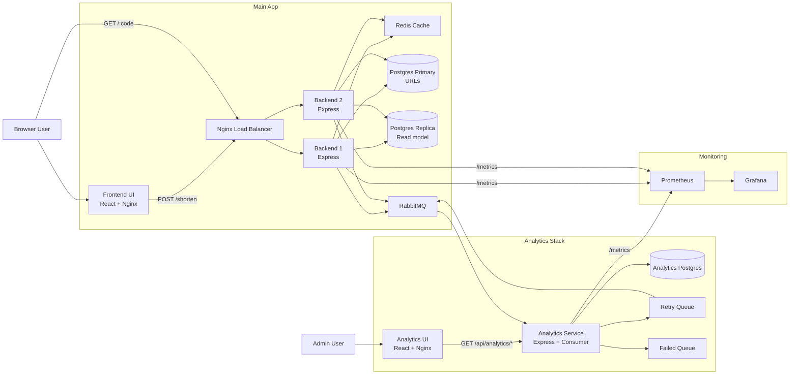
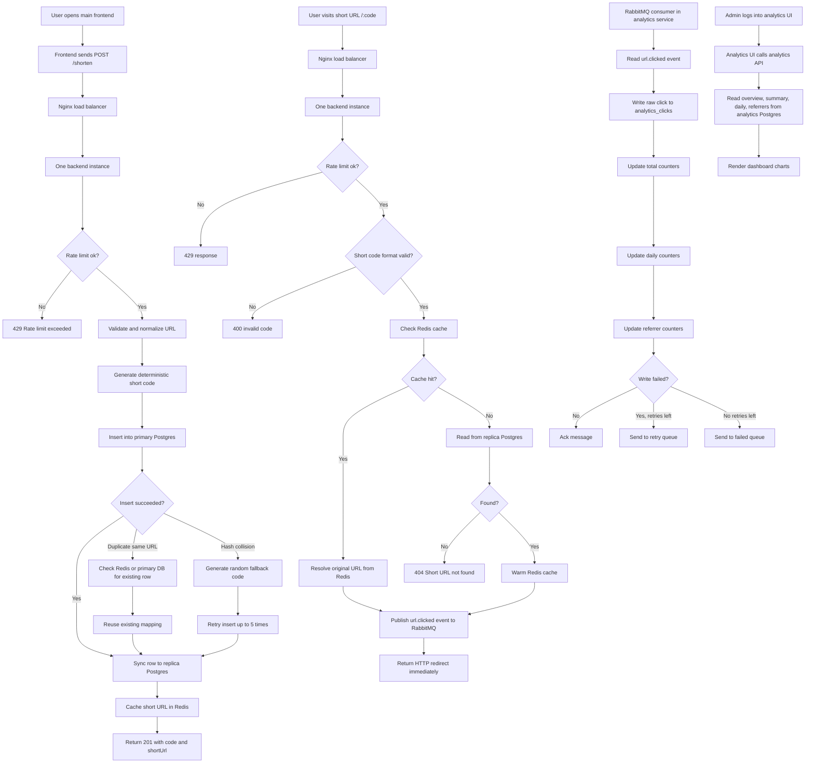

# URL Shortener Architecture Diagrams

These diagrams reflect the current structure and request paths implemented in this repository.

## High-Level Architecture

```mermaid
flowchart LR
    U[Browser User]
    AU[Admin User]

    subgraph Main["Main App"]
        F["Frontend UI<br/>React + Nginx"]
        LB["Nginx Load Balancer"]
        B1["Backend 1<br/>Express"]
        B2["Backend 2<br/>Express"]
        R["Redis Cache"]
        P[("Postgres Primary<br/>URLs")]
        RP[("Postgres Replica<br/>Read model")]
        MQ["RabbitMQ"]
    end

    subgraph Analytics["Analytics Stack"]
        AUI["Analytics UI<br/>React + Nginx"]
        AS["Analytics Service<br/>Express + Consumer"]
        AD[("Analytics Postgres")]
        RETRY["Retry Queue"]
        FAIL["Failed Queue"]
    end

    subgraph Obs["Monitoring"]
        PROM["Prometheus"]
        GRAF["Grafana"]
    end

    U --> F
    F -->|"POST /shorten"| LB
    U -->|"GET /:code"| LB

    LB --> B1
    LB --> B2

    B1 --> R
    B2 --> R
    B1 --> P
    B2 --> P
    B1 --> RP
    B2 --> RP
    B1 --> MQ
    B2 --> MQ

    AU --> AUI
    AUI -->|"GET /api/analytics/*"| AS
    AS --> AD
    MQ --> AS
    AS --> RETRY
    RETRY --> MQ
    AS --> FAIL

    B1 -->|"/metrics"| PROM
    B2 -->|"/metrics"| PROM
    AS -->|"/metrics"| PROM
    PROM --> GRAF
```

## Request-by-Request Flow

```mermaid
flowchart TD
    A["User opens main frontend"] --> B["Frontend sends POST /shorten"]
    B --> C["Nginx load balancer"]
    C --> D["One backend instance"]

    D --> E{"Rate limit ok?"}
    E -- No --> E1["429 Rate limit exceeded"]
    E -- Yes --> F["Validate and normalize URL"]

    F --> G["Generate deterministic short code"]
    G --> H["Insert into primary Postgres"]

    H --> I{"Insert succeeded?"}
    I -- Yes --> J["Sync row to replica Postgres"]
    J --> K["Cache short URL in Redis"]
    K --> L["Return 201 with code and shortUrl"]

    I -- "Duplicate same URL" --> M["Check Redis or primary DB for existing row"]
    M --> N["Reuse existing mapping"]
    N --> J

    I -- "Hash collision" --> O["Generate random fallback code"]
    O --> P["Retry insert up to 5 times"]
    P --> J

    Q["User visits short URL /:code"] --> R["Nginx load balancer"]
    R --> S["One backend instance"]

    S --> T{"Rate limit ok?"}
    T -- No --> T1["429 response"]
    T -- Yes --> U{"Short code format valid?"}
    U -- No --> U1["400 invalid code"]
    U -- Yes --> V["Check Redis cache"]

    V --> W{"Cache hit?"}
    W -- Yes --> X["Resolve original URL from Redis"]
    W -- No --> Y["Read from replica Postgres"]
    Y --> Z{"Found?"}
    Z -- No --> Z1["404 Short URL not found"]
    Z -- Yes --> AA["Warm Redis cache"]

    X --> AB["Publish url.clicked event to RabbitMQ"]
    AA --> AB
    AB --> AC["Return HTTP redirect immediately"]

    AD["RabbitMQ consumer in analytics service"] --> AE["Read url.clicked event"]
    AE --> AF["Write raw click to analytics_clicks"]
    AF --> AG["Update total counters"]
    AG --> AH["Update daily counters"]
    AH --> AI["Update referrer counters"]

    AI --> AJ{"Write failed?"}
    AJ -- No --> AK["Ack message"]
    AJ -- "Yes, retries left" --> AL["Send to retry queue"]
    AJ -- "No retries left" --> AM["Send to failed queue"]

    AN["Admin logs into analytics UI"] --> AO["Analytics UI calls analytics API"]
    AO --> AP["Read overview, summary, daily, referrers from analytics Postgres"]
    AP --> AQ["Render dashboard charts"]
```
